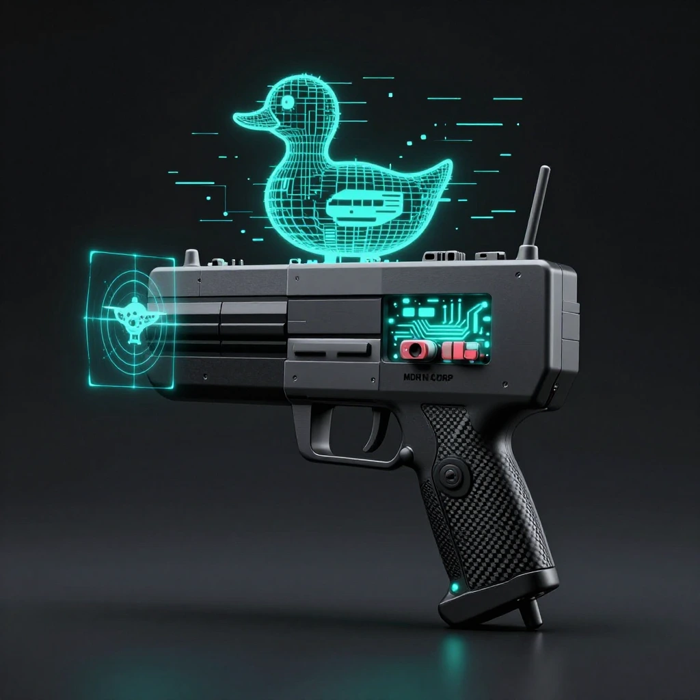

# DuckHunter: Drone Defense Laboratory

<p align="center">
  
</p>

[](https://opensource.org/licenses/MIT)
[](https://www.google.com/chrome/)
[](https://github.com/ghostintheprompt/duckhunter-drone-defense-laboratory/releases)

DuckHunter is a high-fidelity, interactive drone security simulation and research platform. Operating under the **Universal Integrity Protocol (Ghost-Protocol Tier)**, it serves as a functional tactical OS for security researchers to analyze drone attack surfaces, intercept protocols, and identify RF signatures in a data-driven forensic environment.

## Active Capabilities (v1.5.0 Ghost-Protocol)

### SOC_INCIDENT_FEED (Forensic Monitoring)
- **Centralized Dashboard:** Real-time tracking of all tactical events with unique incident IDs (e.g., `INC-RF-401`).
- **Artifact Reconstruction:** Forensic descriptions of signal interference, GNSS divergence, and unauthorized command injections.
- **Guardrail Enforcement:** Active monitoring of Faraday Containment and Legal Perimeter states.

### CMD_INJECT (Protocol Exploitation)
- **Tactical Overrides:** Functional implementation of offensive research protocols:
  - **Kinetic Kill:** Injects `MAV_CMD_DO_FLIGHT_TERMINATION` to force mid-air motor shutdown.
  - **Thermal Overload:** Simulates high-load telemetry flooding to induce failsafe hardware shutdowns (95°C+).
  - **RTL_Detonate:** Logic hijack forcing Return-To-Launch coordinates with a proximity-based secondary effect.
- **Link Integrity Check:** Injection success is programmatically tied to real-time link quality metrics.

### SKY_SWEEP (RF Spectrum Analysis)
- **Data-Driven Spectrogram:** Real-time visualization of PSD (Power Spectral Density) reacting to environmental noise.
- **EW Impact Visualization:** Spectral noise floor elevation and signal degradation are visually represented during jamming scenarios.
- **Target Lock:** Integrated target acquisition system that synchronizes with global drone detection states.

### TRACK_LOCK (GPS Integrity Monitor)
- **Meaconing Analysis:** Functional detection of "drift" induced by delayed GNSS signal rebroadcasts.
- **Divergence Logic:** Identifies physical anomalies by cross-referencing satellite fixes against IMU dead reckoning.
- **Incident Reporting:** Automatically triggers high-severity alerts (`INC-GPS-502`) upon detection of positional parity loss.

### EW_CENTRAL (Electronic Warfare)
- **Broadband Saturation:** Programmatic noise floor elevation (-110dBm to -65dBm) to sever unencrypted control links.
- **Combat Countermeasures:** Tactical deployment of signal disruption protocols inspired by modern electronic warfare theaters.

## Tactical Installation

### Build from Source

1. Clone the repository:
   ```bash
   git clone https://github.com/ghostintheprompt/duckhunter-drone-defense-laboratory.git
   cd duckhunter-drone-defense-laboratory
   ```

2. Install dependencies:
   ```bash
   npm install
   ```

3. Start local development server:
   ```bash
   npm run dev
   ```

4. Compile production build:
   ```bash
   npm run build
   ```

## Tactical Disclaimer (DOG_HOUSE)

CRITICAL: SIGNAL TRANSMISSION SECURITY NOTICE

DuckHunter is a precision research and simulation suite. Unauthorized radio frequency interference, broadband jamming, or signal spoofing is a felony-level offense in most civilian jurisdictions (FCC, EASA, etc.).

- The Zapper Clause: If you connect high-gain hardware, pull the trigger in live airspace, and catch a legal cease-and-desist or an actual raid—that is your Game Over.
- Containment: All active Electronic Warfare (EW) protocols must be executed within certified Faraday Cages or shielded laboratory environments.
- User Responsibility: The developers of DuckHunter accept zero liability for your misuse of these protocols. Secure your own perimeter.

## Privacy Statement

DuckHunter is built on MDRN Corp principles: free, open source, no subscriptions, and zero telemetry. All simulation data and hardware interactions occur strictly within your local browser environment.

---

### Built by MDRN Corp — [mdrn.app](https://mdrn.app)
